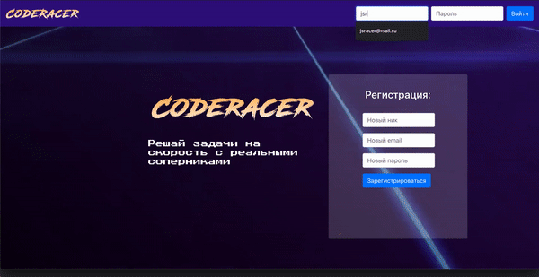

## CodeRacer - платформа для решения задач JS на скорость с реальными соперниками.

https://code-racer.herokuapp.com/

#### 1. Установить зависимости проекта (dependencies) - `yarn`

#### 2. Запуск проекта - `yarn start`

### Экран игры

#### Фишки:

1. Код выполнятеся на стороне клиента в отдельном потоке с помощью Web Worker
2. Если выполнение кода занимает больше одной секунды, процесс прекращается принудительно. Это позволяет нам избежать зависания вкладки, если пользователь напишет бесконечный цикл
3. Так как код выполняется не на странице, пользователь не может случайно или специально изменить элементы DOM на странице
4. Поддерживаются рекурсивные функции - достаточно вызвать функцию 'foo'

